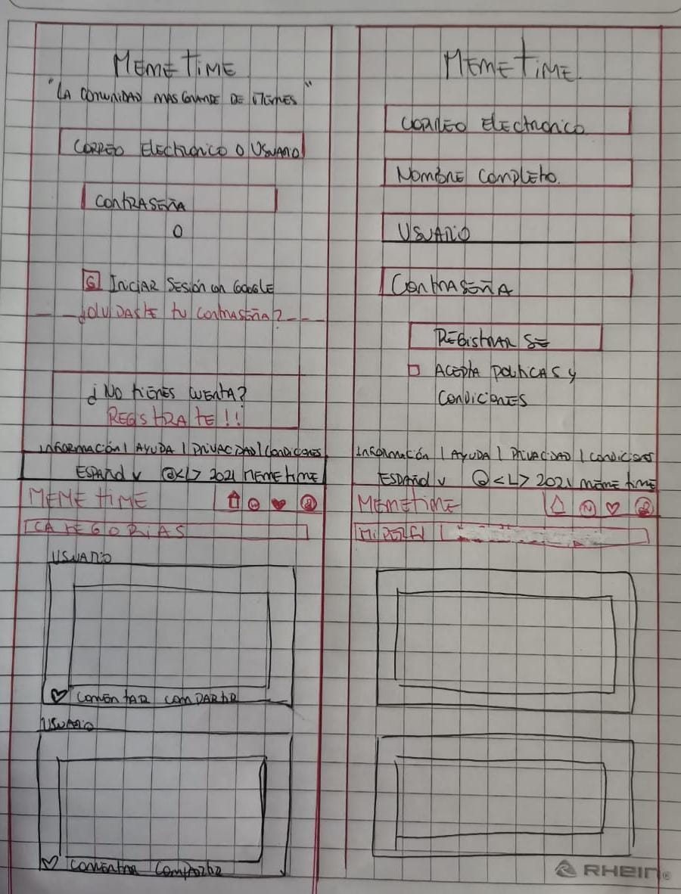
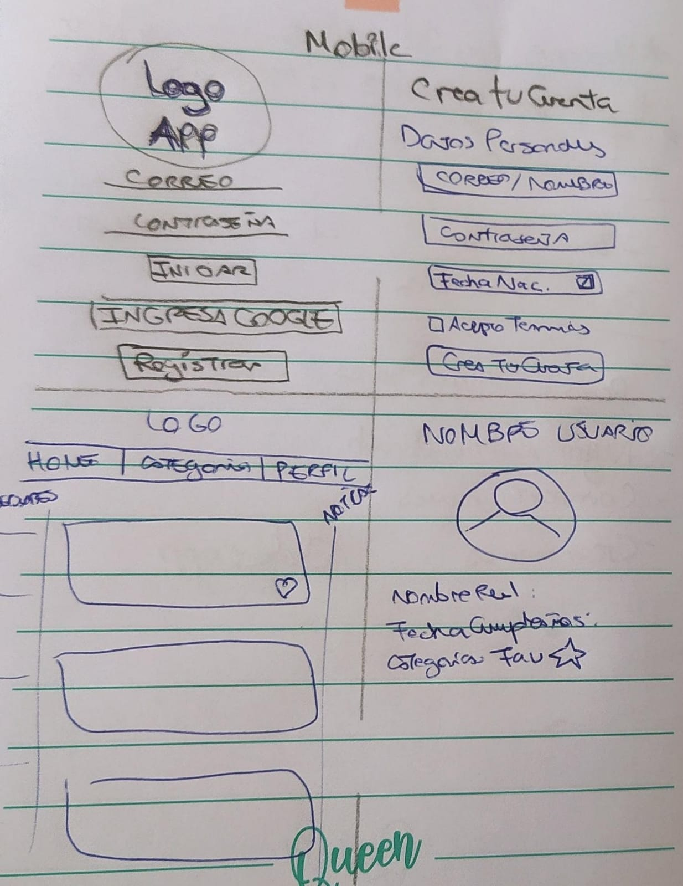
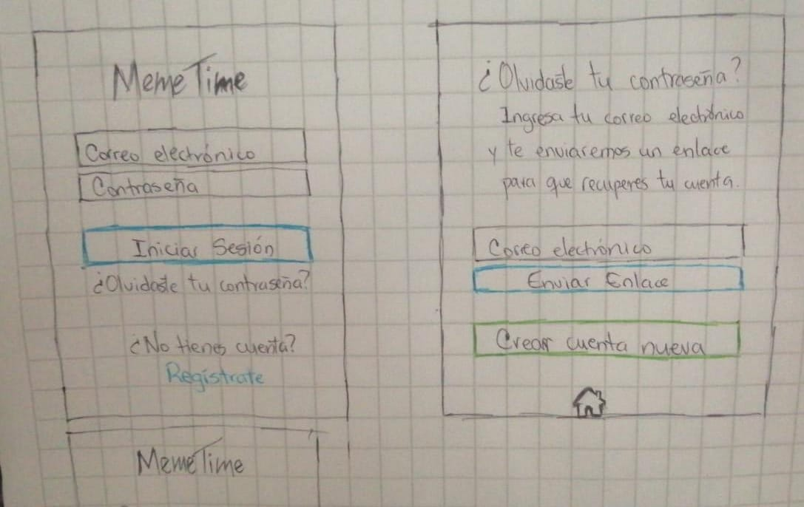
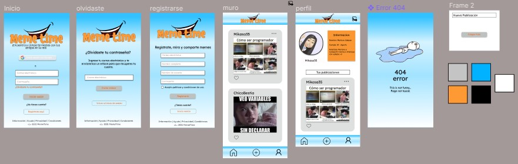
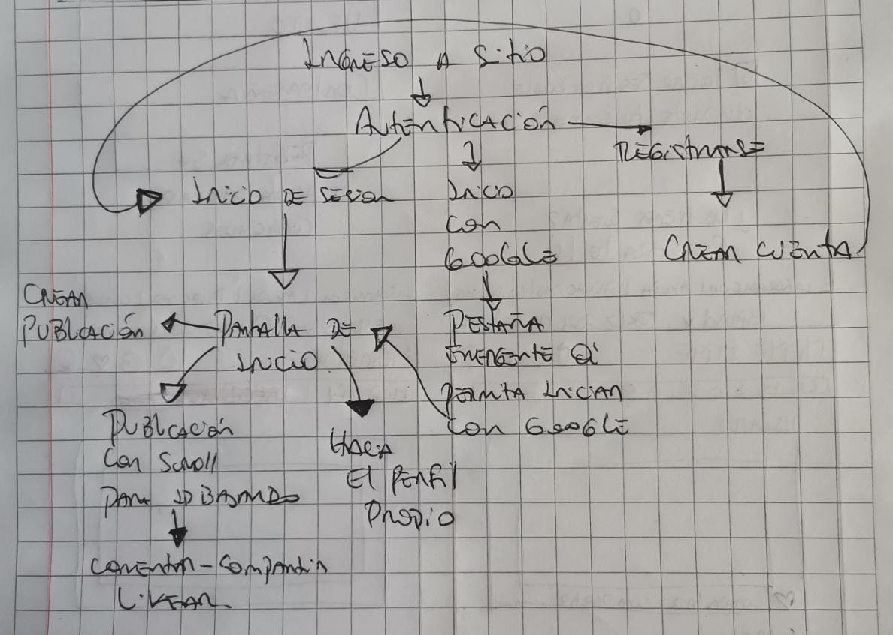
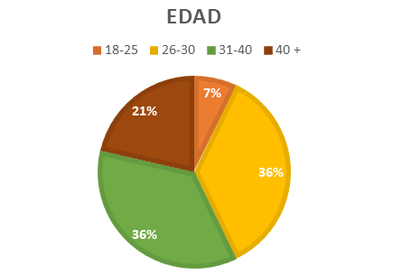

# MEME TIME
## Encuentra y comparte memes con tus amigos en la red

* [1. ¿Por qué memes?](#1-por-que-memes)
* [2. Perfil de usuario](#2-perfil-de-usuario)
* [3. Historias de usuario](#3-historias-de-usuario)

## 1. ¿Por qué memes?

Debido a la pandemia, ha incrementado el uso de las redes sociales por parte de los usuarios por lo que surge la necesidad de crear un lugar de ocio donde éstos puedan informarse de una manera diferente a lo habitual y a su vez entretenerse para desligar un poco de las preocupaciones de la vida cotidiana. Así también, compartir con amigos en común fomentando la comunicación y las relaciones interpersonales. 

Debido a esto, en su primera versión decidimos hacerla para compartir risas, textos graciosos que hicieran pasar un rato ameno, para ello hicimos nuestros primeros prototipos de baja fidelidad: 

Luego de ello, realizamos votaciones por medio de googleForms, derivando en iteraciones sobre el diseño quedando el prototipo de alta fidelidad de la siguiente manera: 

Siguiendo los pasos de la planificación hicimos un diagrama de flujo en el cual nos indicaría los pasos que el usuario debía seguir dentro de la app. 

De allí partimos a realizar la app "Meme time", para mirar y compartir memes.

## 2. Perfil de usuario

El usuario es el adulto en el rango de 18 años en adelante situándose en la generación X y Z mayormente, buscando un lugar para compartir contenido de entretenimiento e información desde una perspectiva diferente.

## 3. Historias de usuario
### HU1

Como usuario de “Meme Time” quiero poder loguearme con correo y contraseña o correo gmail.

Para:  poder ver el contenido disponible en la página.

**Criterios de aceptación**

* Crear página de inicio de sesión con opción a loguear con correo y contraseña, o correo  Gmail. 

### HU2

Como usuario de “Meme Time” quiero poder registrarme con correo y contraseña.

Para:  poder crear una cuenta y ser parte de la red social.

**Criterios de aceptación**

* Registrarse con datos completos. 

### HU3

Como usuario de “Meme Time” quiero poder recuperar mi contraseña. 

Para:  poder acceder de nuevo a la red si la pierdo. 

**Criterios de aceptación**

* Poder acceder a la página de recuperar contraseña. 

### HU4

Como usuario de “Meme Time” quiero poder crear publicaciones en mi muro.

Para: compartir con mis amigos en la red e ir guardandolas.

**Criterios de aceptación**

* Opción al usuario de crear publicación con fotos. 
* Agregar títulos.

### HU5

Como usuario de “Meme Time” quiero poder ver o linkear memes de otros usuarios.

Para:  demostrar interés a mis amigos sobre sus publicaciones o memes.

**Criterios de aceptación**

* Permitir por medio de botón a los usuarios dar like a las publicaciones.
* Llevar un conteo de los mismos.

### HU6

Como usuario de “Meme Time” quiero poder editar o eliminar publicaciones en caso de que cometa un error.

Para: poder corregirlo si no estoy conforme.

**Criterios de aceptación**

* Poder editar posts que ya fueron publicados. 
* Poder eliminar posts que ya fueron publicados.

### HU7

Como usuario de “Meme Time” quiero poder tener ayudas visuales sobre la información que piden.

Para: hacer más rápido el proceso de loguearme.

**Criterios de aceptación**

* Colocar en cada input, el placeholder correspondiente (example@correo.com).
* Usar fuentes claras con nombres descriptivos de la acción a la que llevan.

### Asimismo, desarrollamos la definición de terminado para cada una quedando de la siguiente manera: 
* Ser una SPA.
* Ser responsive.
* Recibir code review.
* Desarrollo de Test unitarios
* Testeo manual, buscando errores e imperfecciones simples.
* Pruebas de usabilidad e incorporar el feedback de los usuarios como mejoras.
* Desplegar aplicación y etiquetar la versión (git tag).
